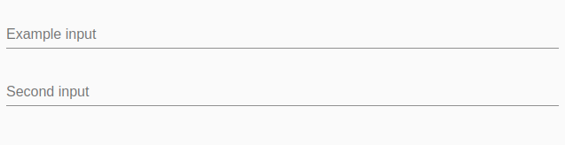

[](https://dl.circleci.com/status-badge/redirect/gh/Micky002/angular-fast-forms/tree/master)
[](https://badge.fury.io/js/@ngx-fast-forms%2Fcore)
[](https://codeclimate.com/github/Micky002/angular-fast-forms/test_coverage)
[](https://codeclimate.com/github/Micky002/angular-fast-forms/maintainability)

# Angular Fast Forms

Angular Fast Forms (AFF) is an angular library which aims to improve development speed
when working with forms. You will not need to write any html anymore to create your forms
simply define them via a well structured config. It is extendable to use your own
form components.

## Core Features

* Create forms without any html
* Provide basic form components out of the box
* Validation support
* Custom form components and validators
* Lazy loading support
* Supports JSON form definitions (also fetching them via HTTP)
* Small size

## Getting started

Install the library in your angular project

```bash
npm i @ngx-fast-forms/core
```

Select one of the provided ui component libraries and also install
it ([or add your own form components](#register-custom-controls)):

* `@ngx-fast-forms/material` (add `MaterialFastFormsModule` to your module imports)

Create your first fast form:

```html

<aff-form-group [form]="form"></aff-form-group>
```

```ts
export class ExampleComponent {

  public form!: FastFormGroup;

  constructor(private formService: FastFormsService) {
    this.form = formService.createDynamicForm([{
      id: 'first-input',
      type: 'input', // depends on used ui component library or use the one registered by yourself
      label: 'Example input'
    }, {
      id: 'second-input',
      type: 'input',
      label: 'Second input'
    }]);
  }
}
```

Start the app and you should see the created form



## Register custom Controls

1. Import `FastFormsModule` to your module imports
2. Create a new angular component. Extend the component from the control base class `BaseFormControlComponent`.
   The `InputProperties`
   is just an example, if your component does not have custom properties you can omit this.

```ts
import { BaseFormControlComponent } from './base-control.component';

@Component({
  selector: 'my-custom-input',
  templateUrl: './input.component.html'
})
export class InputComponent extends BaseFormControlComponent<InputProperties> implements OnInit {

  public get type(): string {
    switch (this.format) {
      case 'text':
        return 'text';
      case 'number':
        return 'number';
      case 'currency':
        return 'number';
      default:
        return 'text';
    }
  }

  public get format(): InputFormat {
    return this.properties.format ?? 'text';
  }
}

interface InputProperties {
  format?: InputFormat;
}
```

3. Add the control html template (see the following for an angular material input example)

```html

<mat-form-field>
  <mat-label *ngIf="question.label">{{question.label}}</mat-label>
  <input #inputElement [formControl]="control" [type]="type" matInput>
  <mat-icon *ngIf="format === 'currency'" matSuffix>€</mat-icon>
  <mat-error *ngIf="control.hasError('required')">
    Value is required
  </mat-error>
</mat-form-field>
```

4. Register the control in your module

```ts
@NgModule({
  imports: [
    CommonModule,
    ReactiveFormsModule,
    FastFormsCoreModule,
    MatInputModule,
    MatIconModule
  ],
  declarations: [
    InputComponent,
  ],
  exports: [
    FastFormsCoreModule
  ],
  providers: [
    {
      provide: DYNAMIC_FORM_CONTROL,
      multi: true,
      useValue: {
        type: 'custom-input',
        component: InputComponent
      } as DynamicFormDefinition
    }
  ]
})
export class CustomFormControlModule {
}
```
